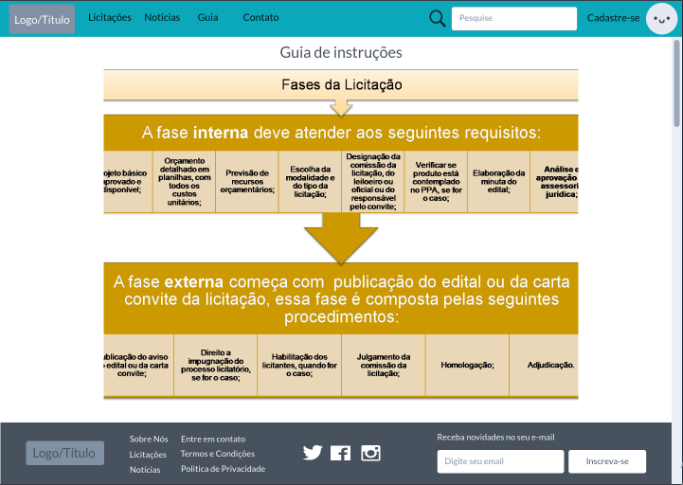
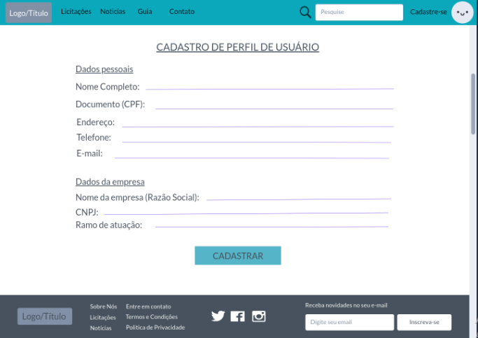
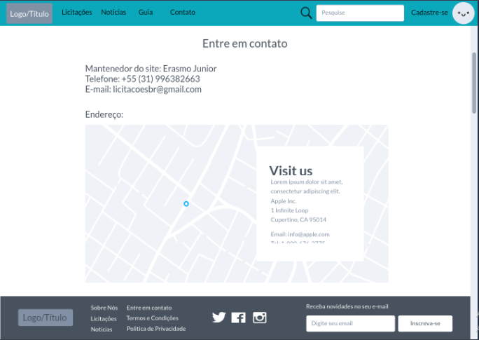

# Projeto de Interface

Pré-requisitos: <a href="2-Especificação do Projeto.md"> Documentação de Especificação</a>

Nesta etapa do projeto buscamos desenhar um esboço das telas e incorporar na interface deste sistema todos os requisitos funcionais definidos previamente. As telas possuem uma Identidade visual padronizada e um design bastante limpo e objetivo para melhor usabilidade, agilidade e acessibilidade, tanto nos dispositivos móveis quanto no Desktop.

## Fluxo do Usuário

O diagrama apresentado na Figura abaixo, mostra o fluxo de interação do usuário pelas telas do sistema. Cada uma das telas deste fluxo é detalhada na seção de Wireframes que se segue. Para visualizar o wireframe interativo, acesse o link:(https://marvelapp.com/prototype/2ge6bdh6).

## Wireframes

Conforme fluxo de usuário apresentado no item anterior, as telas do sistema são apresentadas em detalhes nos itens que se seguem. As telas possuem uma estrutura comum que é apresentada na Figura abaixo. Nesta estrutura, existem três grandes blocos, descritos a seguir. São eles:

> - Header ou Cabeçalho - local onde são dispostos elementos fixos de identidade (logo) e navegação principal do site (menu da aplicação);
> - Conteúdo Principal - apresenta o conteúdo da tela em questão;
> - Footer ou Rodapé - O rodapé ou footer, apresenta informações úteis como endereço, telefone de contato e redes sociais, além de facilitar a navegação dos usuários e auxiliar a alcançar os objetivos.

## Tela 1 - Página Inicial

A tela de Página Inicial mostra notícias de destaque a partir da API utilizada pelo sistema. Com base na estrutura padrão, o bloco de Conteúdo traz as notícias em destaque (imagem, título, data, fonte e resumo, ícone para ver a notícia completa) e um campo de pesquisa por palavra-chave.

## Tela 2 - Pesquisa Licitações

Nesta seção encontra-se uma uma barra de pesquisa de processos de licitações, podendo utilizar filtros na busca, e os resultados encontrados. As licitações que o usuário desejar fazer o acompanhamento devem ser seguidas através do botão “+” disponível ao lado da caixa com o conteúdo.

## Tela 3 - Notícia completa e comentários

A tela de notícia completa e comentários apresenta o conteúdo completo da notícia, a possibilidade de fazer um comentário, ler os já existentes, e também a funcionalidade de compartilhamento da notícia nas redes sociais.

## Tela 4 - Guia

A tela a seguir apresenta um guia de como é o funcionamento de um processo de licitação. A intenção é ajudar o leitor a se localizar perante as fases de uma licitação e orientá-lo quanto aos seus objetivos em um processo deste tipo.

## Tela 5 - Cadastro de Usuário

A tela de cadastro permite ao usuário fazer o input das suas informações no sistema. É exigido nesta etapa as informações pessoais e da empresa que pretende participar dos processos licitatórios. Os dados serão armazenados em um banco de dados.

## Tela 6 - Acompanhamento dos processos selecionados

Nesta parte o usuário poderá acompanhar os processos de licitação previamente selecionados por ele. Aqui ele terá acesso às informações detalhadas de cada processo, como prazo, documentação, status da licitação e demais informações relevantes.

## Tela 7 - Contato/Suporte

A tela de Contato/suporte reúne informações a respeito do mantenedor do site, telefone de contato, email e endereço. Nesta seção o usuário encontra também um mapa indicando a localização geográfica da empresa.

